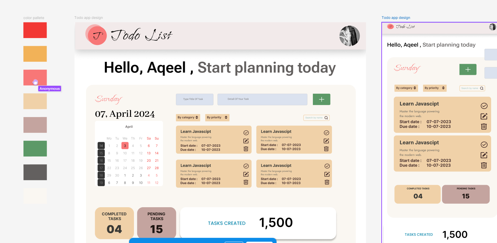
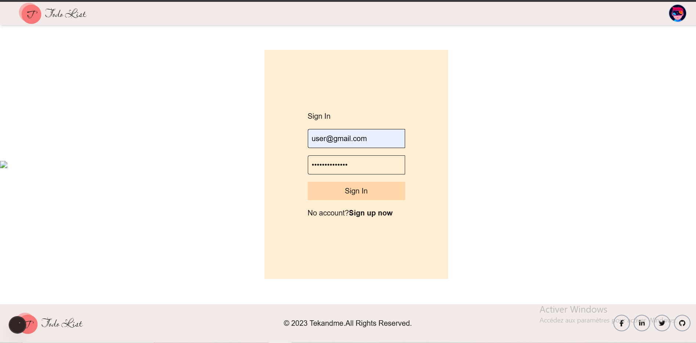
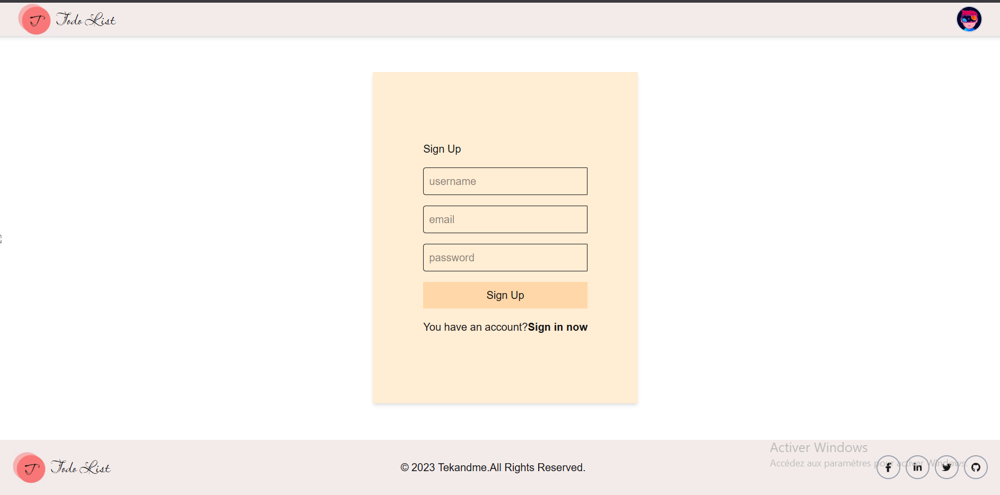

Task Manager App
This is a simple Task Manager application built with Next.js (React framework) and Strapi (Headless CMS). The application allows users to manage their tasks, with features to create, edit, delete, and mark tasks as completed. The frontend uses Material UI (MUI) for components and icons.

Features
User Authentication: Register and login functionality.

Task Management: Add, update, delete, and mark tasks as completed.

User Profile: Each user has their profile to view tasks.

Material UI: Beautiful, responsive UI with icons for task actions.

Real-time Data: Fetch data from a Strapi backend.

Tech Stack
Frontend: Next.js (React framework)

Backend: Strapi (Headless CMS)

Authentication: JWT (JSON Web Token)

UI Library: Material UI (MUI)

Strapi Login : 
tawdev
Admin111²

